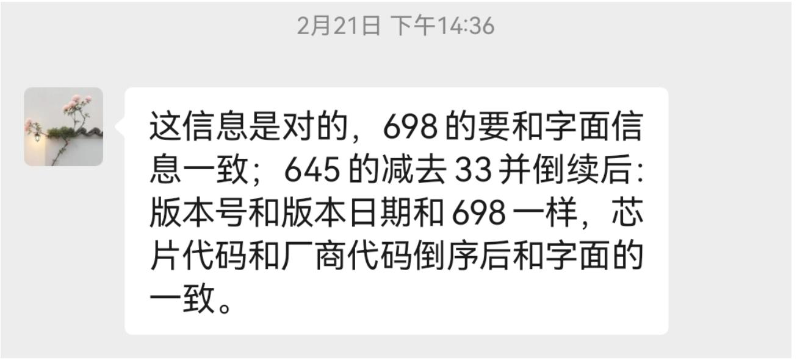
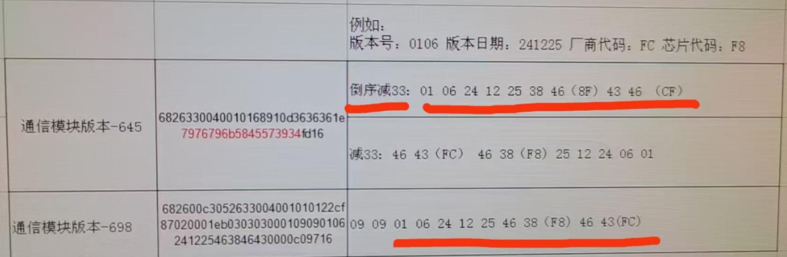

# 福建24-2批送检问题归纳

## 一、福建送检问题归纳

### 1、福建 645 版本号要求

信息来源：福建送检测试人员——张秀兰张工。





### 2、测试过零 NTB 要求

#### （1）整分整秒首个过零 NTB 与 CCO 区间关系

STA 上报上来的整分整秒的第一个过零 NTB 值（`eb020207`），必须位于 CCO 同一时间上报上来的过零 NTB 值（`eb030309`）之间，否则视为失败。

**示例：CCO 上报**

```
2025-02-26 22:15:04.120 22:15:04 [165] [AFN06-F55] <=:68 D9 01 C3 04 00 00 00 00 A5 66 00 66 00 66 00 66 00 66 00 66 00 06 40 06 01 03 BA 01 68 B8 01 83 05 66 00 66 00 66 00 00 CB AE 88 01 01 01 EB 03 03 09 01 09 82 01 9A 25 02 26 22 15 00 01 64 00 00 BD 78 05 F9 BD 7F A5 CE BD 87 45 B1 BD 8E E5 8A BD 96 85 61 BD 9E 25 3F BD A5 C4 FA BD AD 64 DF BD B5 04 99 BD BC A4 86 BD C4 44 57 BD CB E4 34 BD D3 84 1E BD DB 23 D5 BD E2 C3 A3 BD EA 63 7F BD F2 03 61 BD F9 A3 2F BE 01 42 F9 BE 08 E2 D1 BE 10 82 95 BE 18 22 7F BE 1F C2 28 BE 27 62 33 BE 2F 01 F5 BE 36 A1 D4 BE 3E 41 98 BE 45 E1 5B BE 4D 81 4F BE 55 20 F5 BE 5C C0 DC BE 64 60 CA BE 6C 00 7F BE 73 A0 44 BE 7B 40 26 BE 82 DF EC BE 8A 7F B8 BE 92 1F 98 BE 99 BF 66 BE A1 5F 37 BE A8 FF 2F BE B0 9F 04 BE B8 3E D8 BE BF DE B0 BE C7 7E 69 BE CF 1E 37 BE D6 BE 07 BE DE 5D E1 BE E5 FD B8 BE ED 9D 96 BE F5 3D 64 BE FC DD 38 BF 04 7D 17 BF 0C 1C F3 BF 13 BC BF BF 1B 5C 85 BF 22 FC 73 BF 2A 9C 51 BF 32 3C 1B BF 39 DB E8 BF 41 7B B8 BF 49 1B 9E BF 50 BB 7C BF 58 5B 49 BF 5F FB 32 BF 67 9B 08 BF 6F 3A E1 BF 76 DA BB BF 7E 7A 95 BF 86 1A 78 BF 8D BA 57 BF 95 5A 35 BF 9C F9 EF BF A4 99 D4 BF AC 39 AD BF B3 D9 91 BF BB 79 72 BF C3 19 5D BF CA B9 29 BF D2 59 27 BF D9 F9 05 BF E1 98 D8 BF E9 38 B8 BF F0 D8 91 BF F8 78 78 C0 00 18 58 C0 07 B8 1E C0 0F 57 EF C0 16 F7 EA C0 1E 97 CA C0 26 37 B1 C0 2D D7 BF C0 35 77 91 C0 3D 17 5F C0 44 B7 51 C0 4C 57 22 C0 53 F7 0B C0 5B 96 FB C0 63 36 DA C0 6A D6 B3 00 00 22 BE 16 60 16
```

**示例：STA 上报**

```
2025-02-26 22:15:02.925 22:15:02 [164] [AFN56-F2] <=:68 4A 00 C0 00 00 00 00 00 A4 56 02 00 FF 66 66 09 01 25 20 33 68 31 00 83 05 66 66 09 01 25 20 00 52 7B 88 01 2D 01 EB 03 03 07 01 09 15 25 02 26 22 15 00 01 0F 01 BF F0 FE C4 00 00 00 00 00 00 00 00 00 00 7D 5F 16 D8 16
```

**解析：** 上述 CCO 与 STA 上报的时间节点均为 `250226 22:15:00`。CCO 上报了 100 个过零 NTB 时间点，开始与结束分别为 `BD7805F9` 与 `C06AD6B3`；STA 上报的 1 个过零点为 `BFF0FEC4`。此时满足 `BD7805F9 ≤ BFF0FEC4 ≤ C06AD6B3`，故 STA 数据合格。若 STA 上报的过零 NTB 不在 CCO 上报范围内，则不合格。

#### （2）周期上报过零 NTB 与理论周期偏差

STA 周期上报的过零 NTB 值，与理论周期的偏差应小于 **1000 ms**。

**示例**

```
15:09:38 [015] [AFN52-F1] ->:68 40 00 43 00 00 00 00 00 0F 52 01 00 05 01 11 03 00 00 66 01 0A 0A 25 00 68 23 00 43 05 01 11 03 00 00 66 A0 E5 E4 07 02 00 01 EB 03 03 07 09 09 1C 07 E9 02 1C 0C 2D 00 0A 00 FE 6A 16 15 16
```

```
15:09:39 [015] [AFN52-F1] <=:68 B9 00 80 00 00 00 00 00 0F 52 01 00 05 01 11 03 00 00 66 A1 00 68 9F 00 C3 05 01 11 03 00 00 66 A0 19 C3 87 02 00 01 EB 03 03 07 00 01 09 81 81 25 02 28 12 45 00 01 0F 0A 36 F9 7B BF 00 00 00 00 00 00 00 00 74 23 BA 1F 00 00 00 00 00 00 00 00 B1 37 FC E4 00 00 00 00 00 00 00 00 EE 52 05 BF 00 00 00 00 00 00 00 00 2B 74 B8 8C 00 00 00 00 00 00 00 00 68 91 E0 71 00 00 00 00 00 00 00 00 A5 AE 1C 49 00 00 00 00 00 00 00 00 E2 CA E1 CE 00 00 00 00 00 00 00 00 1F E5 33 0D 00 00 00 00 00 00 00 00 5D 09 F0 88 00 00 00 00 00 00 00 00 00 00 81 16 16 CB 16
```

STA 回复的 10 个 A 相过零 NTB 数据依次为：`36F97BBF`、`7423BA1F`、`B137FCE4`、`EE5205BF`、`2B74B88C`、`6891E071`、`A5AE1C49`、`E2CAE1CE`、`1FE5330D`、`5D09F088`，单位均为 **40 ns**。周期为 15 min 时：

- \(15 \times 60 \times 10^9 / 40 = 22500000000\)，十六进制为 `53D1AC100`；
- 过零 NTB 为 4 字节，舍弃高字节后为 `3D1AC100`（单位仍为 40 ns）。

以首点 `36F97BBF` 为起点，加上 `3D1AC100` 后与下一上报点 `7423BA1F` 的差值为 `F7D60`，约 **40.61 ms**，小于 1000 ms。第 2 点与第 3 点等同理推算。

#### （3）查询过零 NTB 点数与回复点数一致

查询 STA 过零 NTB 点数时，**查询多少个就应回复多少个点**；无数据处填 **0** 即可。

**示例**

```
11:19:07 [012] [AFN52-F1] ->:68 40 00 43 00 00 00 00 00 0C 52 01 00 05 01 11 03 00 00 66 01 0A 0A 25 00 68 23 00 43 05 01 11 03 00 00 66 A0 E5 E4 07 02 00 01 EB 03 03 07 09 09 1C 07 E9 02 1C 0A 1E 00 03 00 41 EF 16 C2 16
```

```
11:19:07 [012] [AFN52-F1] <=:68 64 00 80 00 00 00 00 00 0C 52 01 00 05 01 11 03 00 00 66 4C 00 68 4A 00 C3 05 01 11 03 00 00 66 A0 86 E6 87 02 00 01 EB 03 03 07 00 01 09 2D 25 02 28 10 30 00 01 0F 03 00 00 00 00 00 00 00 00 00 00 00 00 00 00 00 00 00 00 00 00 00 00 00 00 00 00 00 00 00 00 00 00 00 00 00 00 00 00 B7 27 16 FB 16
```

### 3、15 秒内停复电测试

**测试内容：** 三次停复电时间分别为：

- 16:32:40–16:32:50  
- 16:38:06–16:38:16  
- 16:45:52–16:46:00  

要求 **3 次停复电时间均无误差**，且 **上 N 次精准停电记录** 也需无误差。

### 4、数据冻结要求

1. 重新收到**相同**的配置任务后，再次执行与上报时，**存储次数须从 0 开始**。
2. 数据冻结的配置数据存在**带/不带操作码、密码**等两种形式，**两种均需实现**。

**示例（无操作码等）**

```
681c00430599999999999901919906020001ebe0e000090201ff00ca8416
```

**示例（含操作码等）**

```
683c00430578517847010101c30e06020001ebe001020922111111110000000801080f320005c80800c801020d06000001019999999999880f0f00089c16
```

### 5、从节点模块载波接口电压测试

1. **三相表、单相表**均需测试。
2. 电压回复时需支持**两种数据类型**：`0x06` 与 `0x12`。

**示例（0x06）**

```
683700c30516054484000100c40c90001e85020f022000020001010106002225c62001020001010105000000000000010004557a2a7a810316
```

**示例（0x12）**

```
683500c305263300400101005d5190001c85020f02200002000101011208d6200102000101010500000000000001000484f16c0c6d0816
```

### 6、温度异常上报

要求上报格式为 **698 协议类型**；福建计量实验室测试时最高约 **75 ℃**，故要求 **达到 75 ℃即主动上报**。

### 7、停电校时与复电记录

停电后进行校时，待模块复电后需核查**停复电记录中的复电记录**是否正确。

---

## 二、福建计量测试要求记录

1. **EB030304**——查询从节点模块工作电源电压（选配）（12 V）（STA 功能）：即便 698 协议查询，数值也应为 **BCD 码**，而非 BIN。
2. **15 秒停复电**后，STA **时钟不得丢失**。
3. **698 协议查询模块 ID** 时，应以**大端（正序）**回复。
4. **任务类型为 1 的数据冻结任务**：以第 0 种与第 2 种方式查询时，若查询时间早于模块已存储的最早时间，应**直接偏移到模块开始存储的时间**再按点数回复。
5. 当前功能均以 **698 协议**回复：即便 OAD 抄读全部失败，也需将 OAD **上报**，**不得整帧不回复**。
6. **任务类型为 4 的幅值越限上报任务**（主动上报或查询答复）：**「冻结开始时标」**填写为**发生存储所在周期的时间**，即越限后执行存储时**该周期**的时间。
7. 配置**掉电不存储**任务时，模块**复位**后，**存储次数应从 0 开始**。
8. 数据冻结任务配置时，**预计回码长度最大须支持到 0xFF**。
9. **数据冻结（01H）任务**：仅在**后续任务执行时**删除与更新扇区；**校时后无需**删除与更新——若此时删改扇区，会导致任务执行次数耗尽后**不再执行**，长时间后再查询**无数据**。（例：1 分钟任务执行 200 次、存储 10 次，任务结束后中间静置 **2 小时以上**，仍应能查询到**最后执行的数据**。）
10. 停复电测试项目包含 **5 秒、10 秒、1 分钟、随机时间** 等场景。
