# 福建25-1批送检测试报告

## 一、注意事项

1. 无论后期协议如何变更、送检批次如何变更，版本号都不能变更，只需要变更时间即可。
2. 互换性台体中的事件上报和国网台体中互操作测试事件上报时，福建引脚事件上报要默认设置为国网事件上报，否则会测试失败（福建协议中默认福建引脚上报方式），需修改程序，或者设置引脚事件上报方式。
3. 测试格式字 20H 中 89 组兼容任务方案时，配置自己重启自身任务时，协议要求剔除掉，但是测试时要求配置不能直接回复否认帧，要求配置成功，且能看到主动上报（属于执行时过滤），上报的是成功，还是失败，不做要求。

   ```
   683b00430564584444010101290906020001ebe001890921010805000003c80a0003012014ebe0e69806020101ebe0e0080902018900000000001ef016
   ```

4. 测试读取自身温度时，要求温度都有数据，不能出现默认值。

   ```
   682c004305450004420101015dcf06020001ebe001880912010801050064140a0064012105eb030311000021e416
   ```

5. 友商提示，现场智芯 CCO 有一些版本，升级后不下发执行升级。
6. 核查福建配置任务，大部分均是掉电不存储任务，于是增加 RAM 存储方案，减少 FLASH 擦写寿命的压力。
7. FLASH 存储方案要求可以比存储次数多，但是 RAM 存储方案要求，存储次数是多少，就是多少，不能多存储。

## 二、现场测试环境

### 1、整体测试环境


### 2、高低温测试环境

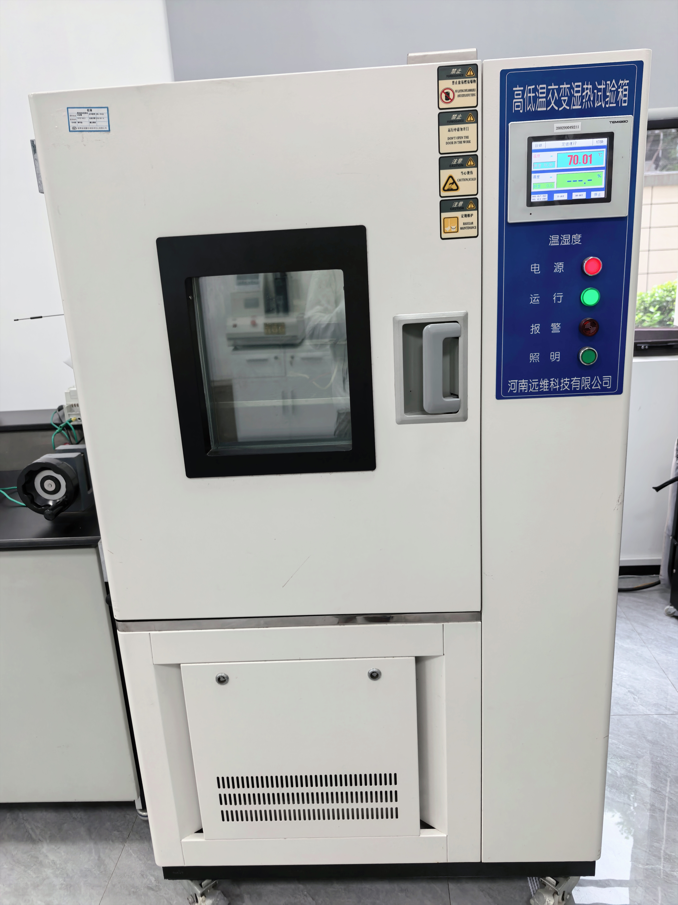

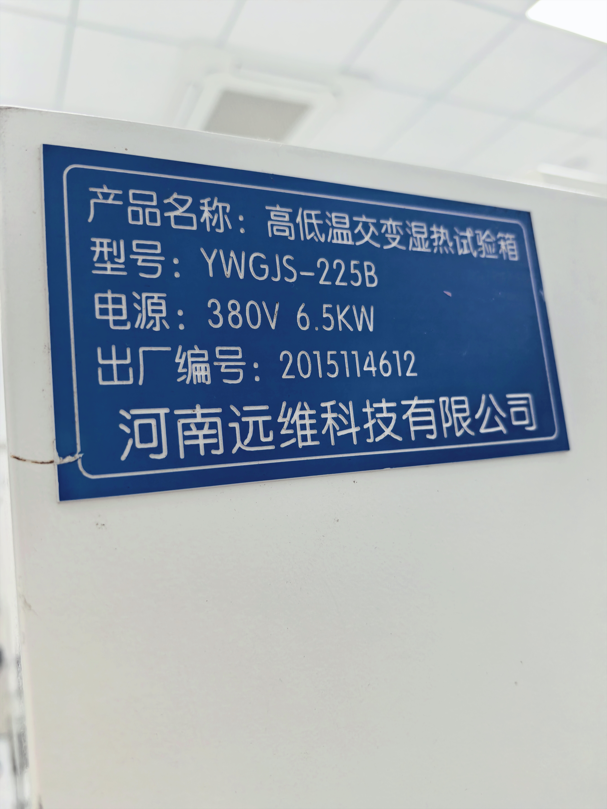

### 3、鼎信停复电台体


### 4、功耗测试台体和互换性测试台体


### 5、国网互联互通台体

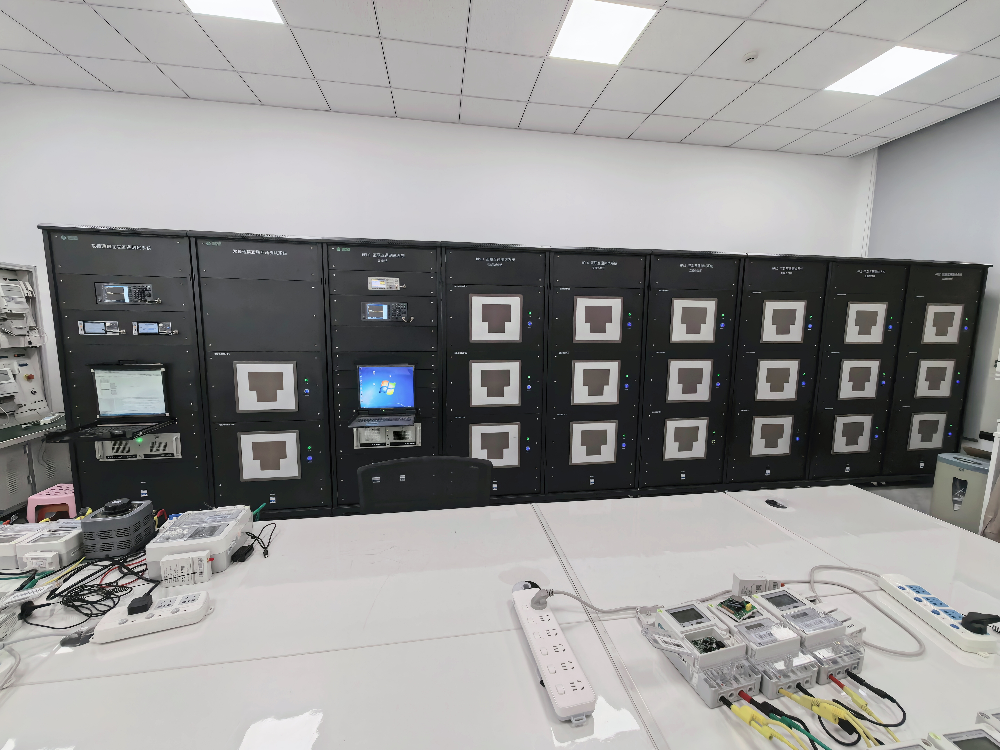

### 6、桌面福建扩展协议测试环境

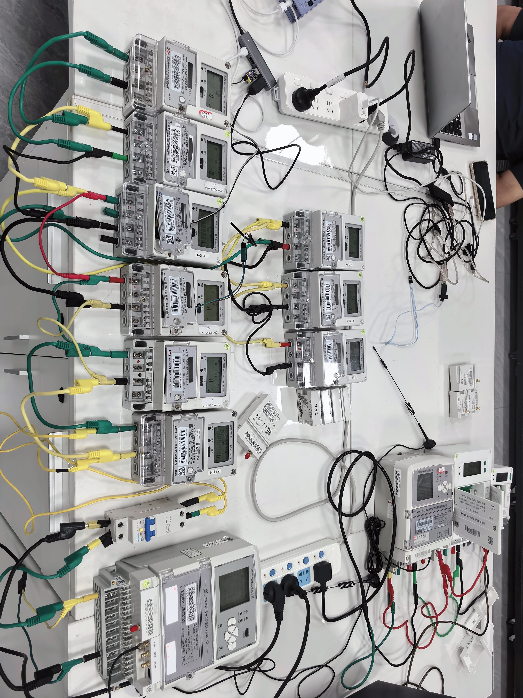

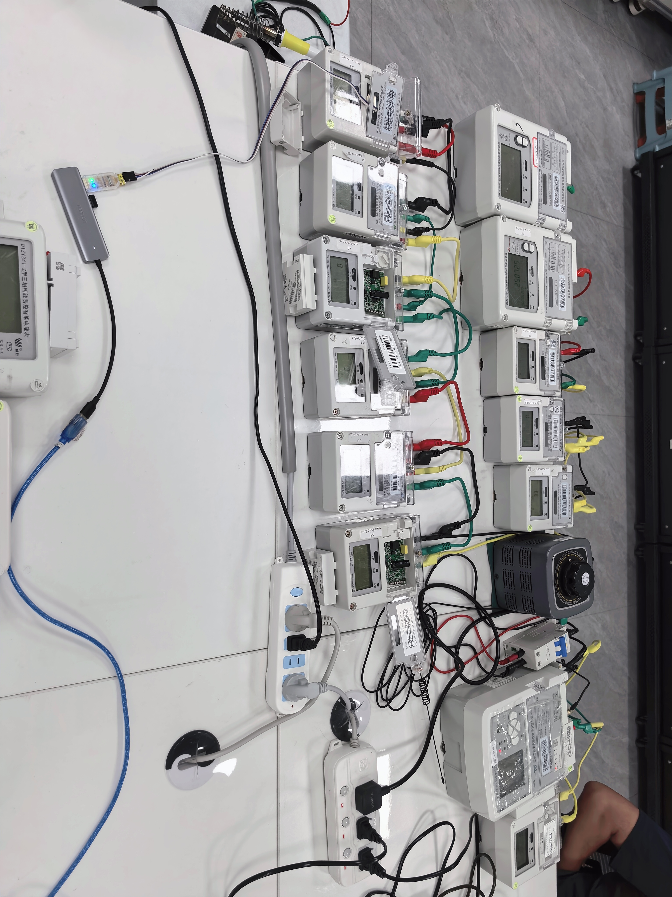


## 三、测试内容问题

### 1、互换性测试台体

#### 1.1、配合东软双模 CCO 测试时，事件上报失败，原因核查如下

##### 1.1.1、

事件上报，698 协议表，最后一步是抄读电能表 3320 事件，抄读回来即合格，但是在抄读前会先给电表上电、进行档案同步，同步后，立即下发抄表帧（注互换性台体和电脑时间误差在 1 秒内）。

##### 1.1.2、

模块端在上电后，发起关联请求后，最后收到了关联确认——不在白名单中。

从上述记录来看，正好在台体给 CCO 下发参数区初始化（01F2）后，收到了 STA 发的关联请求，从而给 STA 回复了关联确认的拒绝入网，从而导致后续 3320 事件抄读失败。

**解决方案：** 后期考虑记录互换性台体主节点地址，多次发起关联请求申请。

### 2、福建扩展协议测试

#### 2.1、配合智芯 CCO 测试福建数据冻结 576 字节长度主动上报时，上报失败

**原因核查：** 实验室环境配合智芯 CCO 时，多次上报时，发送链路走的都是无线链路。

核查协议，无线不能拼包，最多传输 520 字节的物理块。

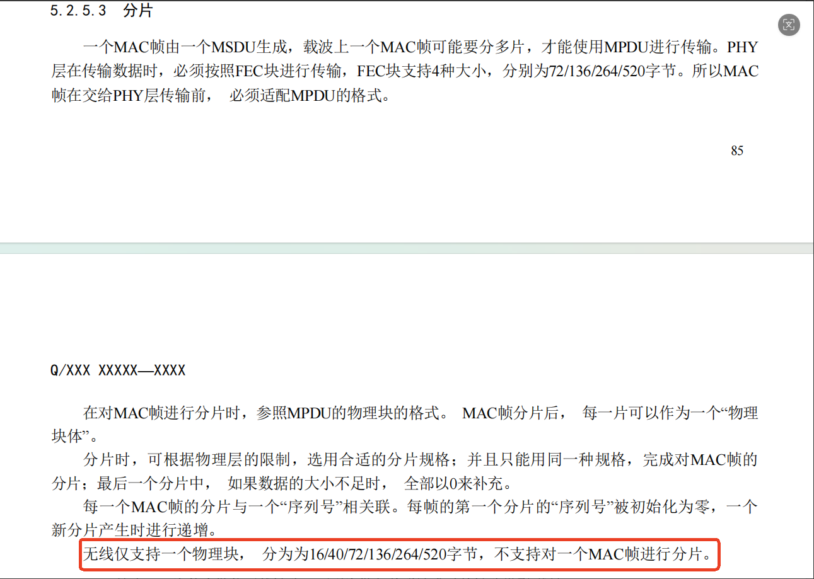

核查 STA 为什么发往无线链路，下列为发起关联请求时的链路类型——载波。

核查报文，发现 STA 由于上个路由周期收到父节点的发送列表个数为 0，从而发起了代理变更请求，变更为了无线链路。

核查为什么上个路由周期收到父节点的发送列表报文个数为 0，查看载波报文：

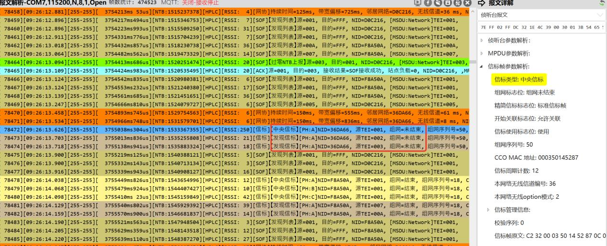

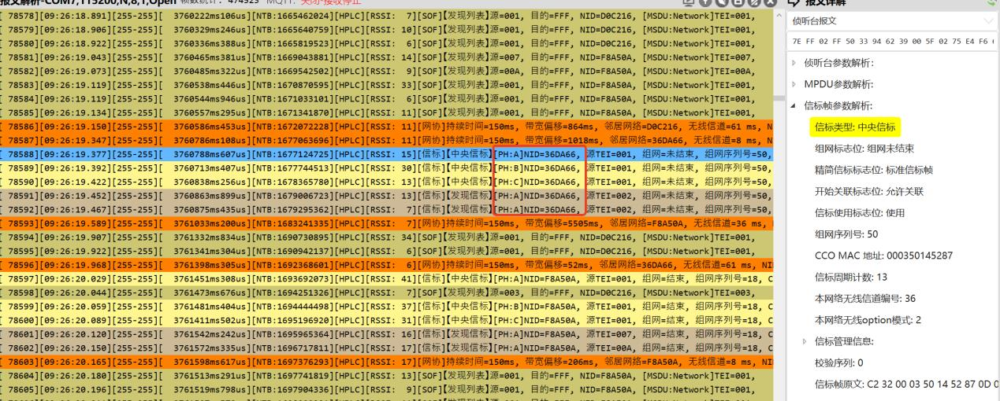

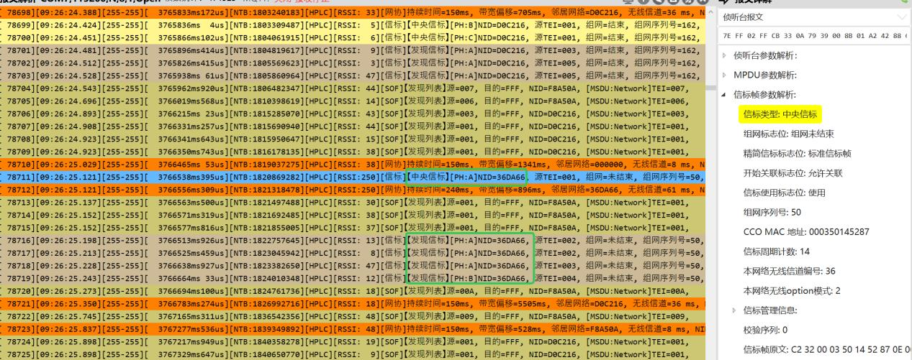

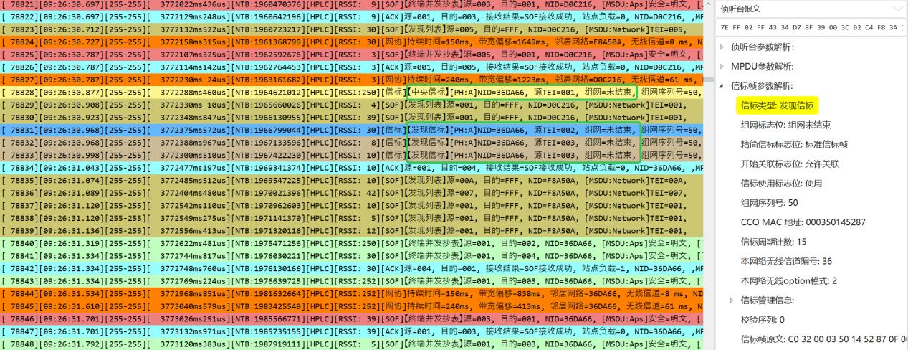

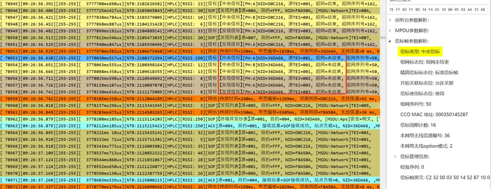

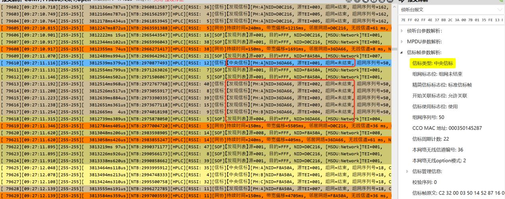

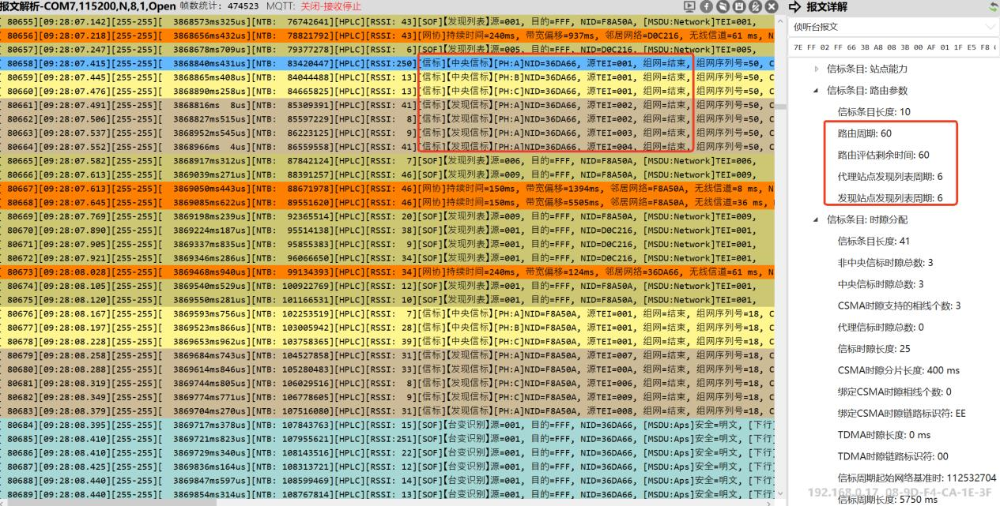

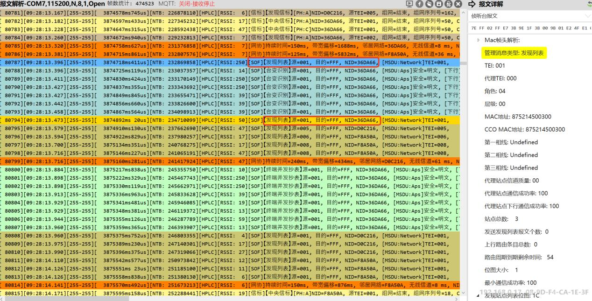

结合上述查看，智芯 CCO，在组网未完成时，仅发送中央信标，不发送发现列表，在组网完成后，才发送发现列表。与协议要求如下：

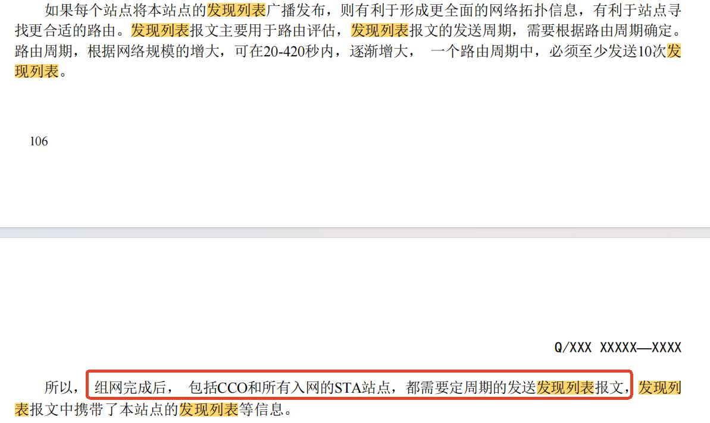

**综上所述：** STA 在配合智芯 CCO 时，由于智芯 CCO 在组网完成前不发送发现列表，仅发送中央信标，导致 STA 在入网后的首个路由周期后，就会主动发起代理变更请求，从而容易和 CCO 属于无线链路组网模式了;

**解决方案：**

配合智芯 CCO 测试，发现仍然会代理变更为无线组网，核查是因为智芯 CCO 在组网完成之前，不发送发现列表，组网完成后发送发现列表，但是在组网完成后的下个路由周期发送发现列表中「发送发现列表报文个数」的上个路由周期发送的发现列表报文个数为 61，是错误的，后续路由周期发送的就是正确的了，为 20 个。

此问题已向智芯反馈，如果想避免此问题，可以考虑将组网完成后的下个路由周期不算在计算通信成功率内，在向后延期一个路由周期。
