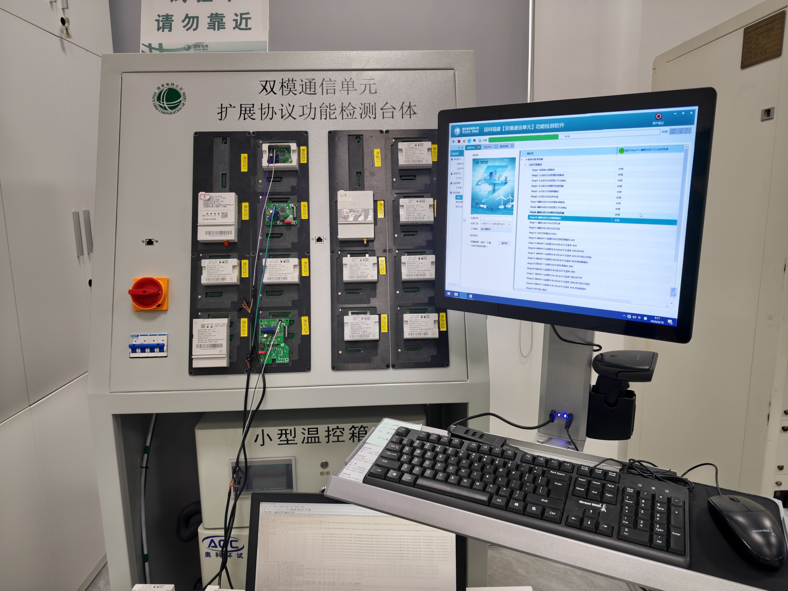
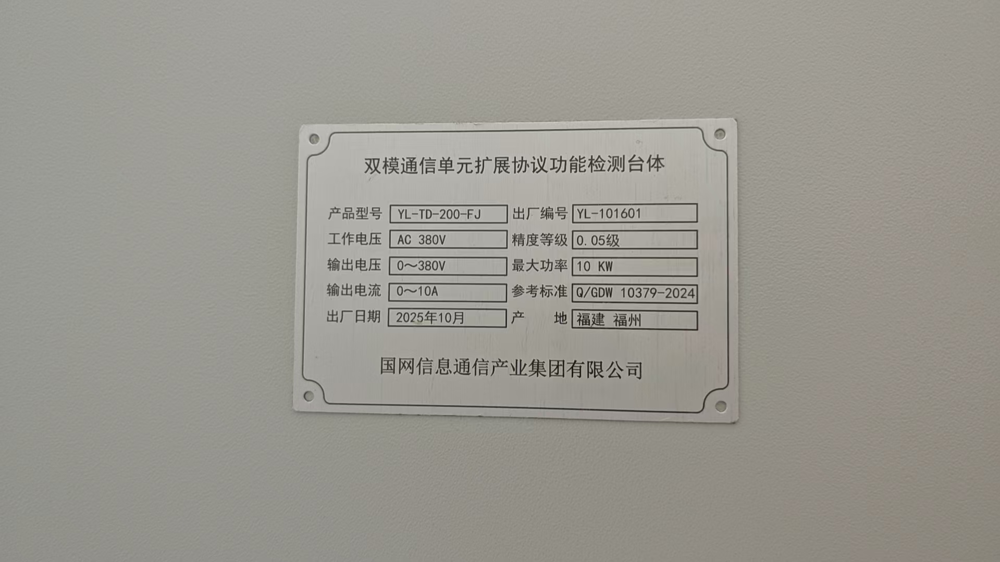
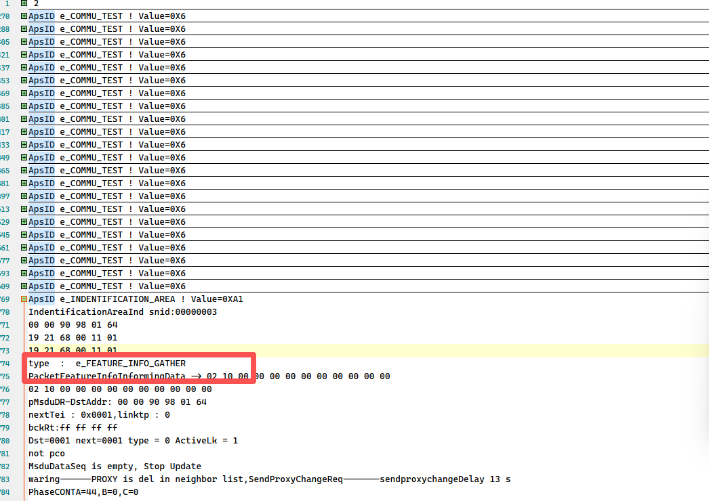
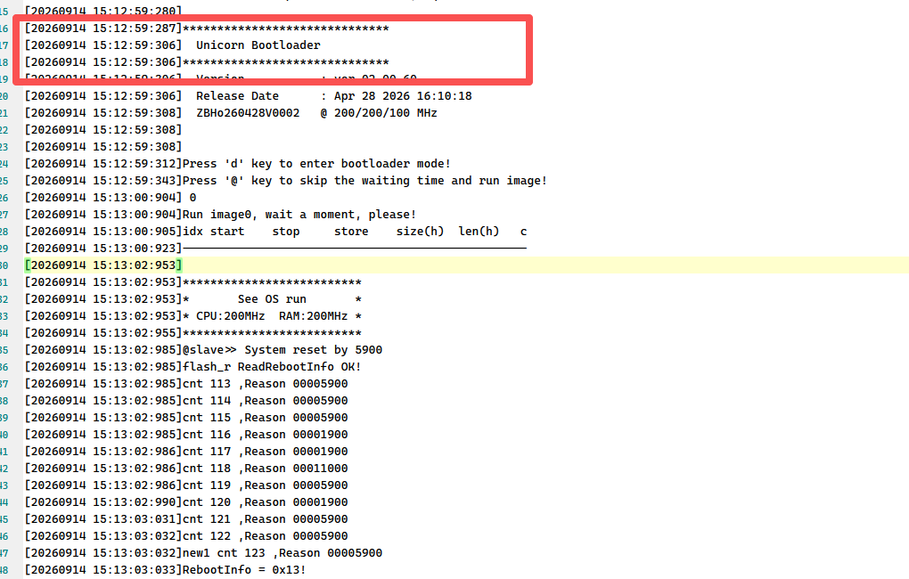
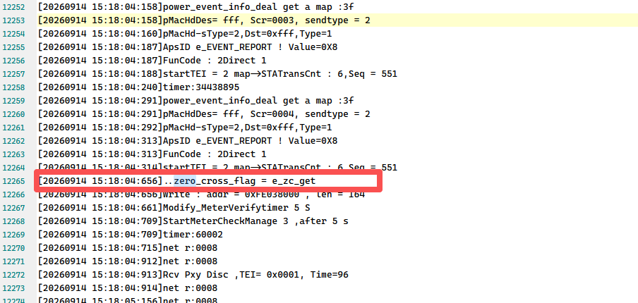
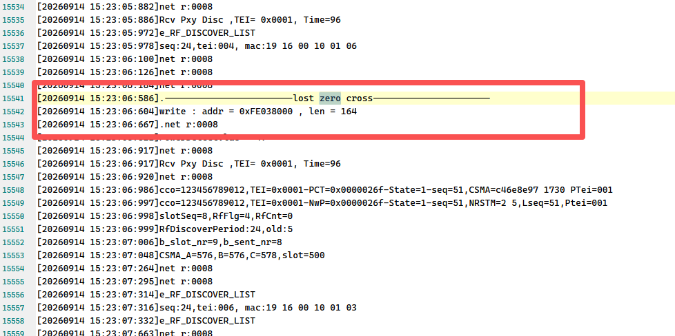
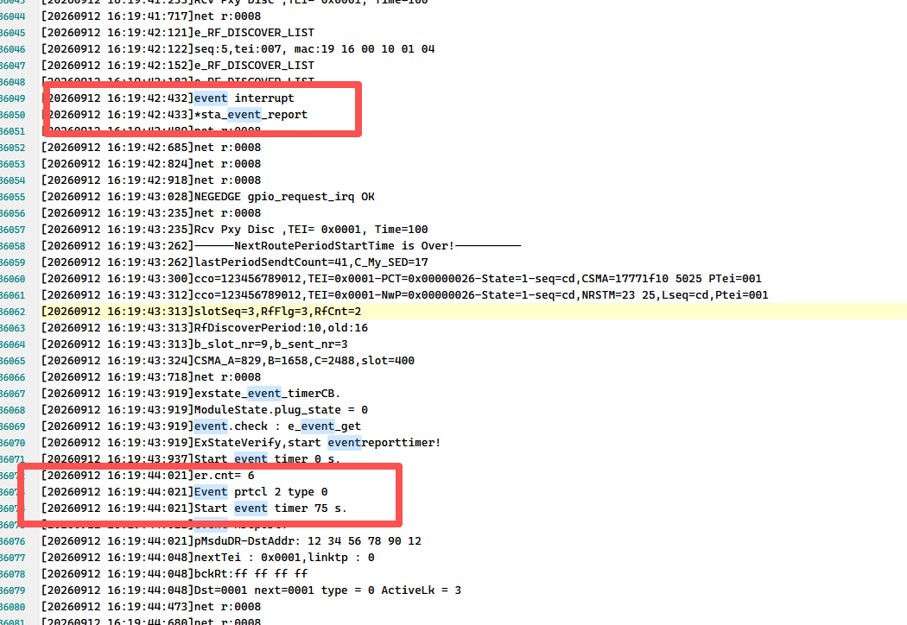
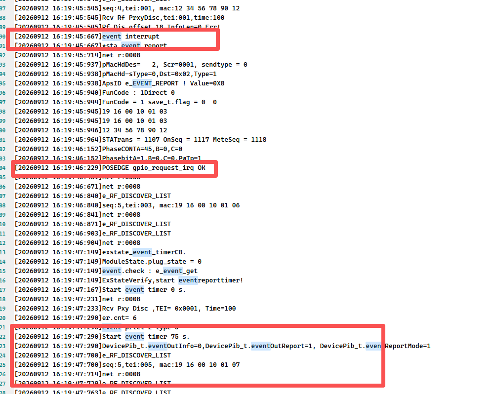
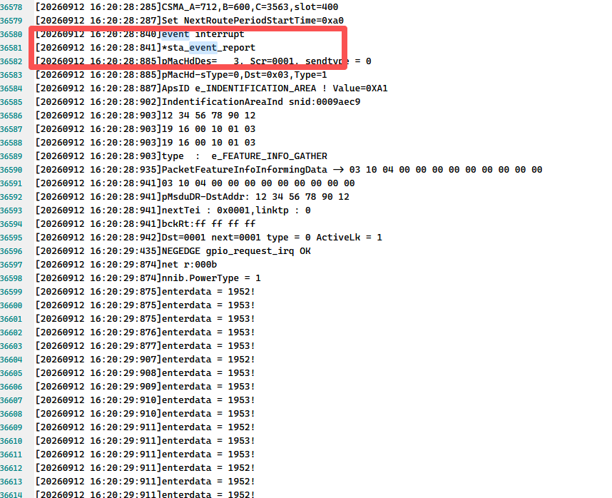
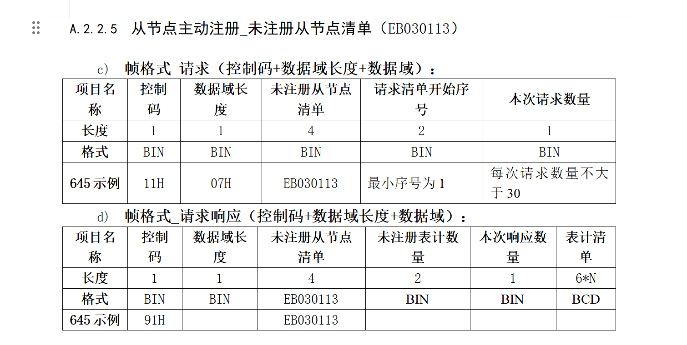

# 福建26-1批送检测试报告

## 一、注意事项

1. 双模互联互通台体上模块的事件上报模式要是国网模式，需要单独出一个国网模式的版本，否则即使配置了国网模式，插到台体上，因换表地址改变也会清除配置变为默认是福建。
2. 现场测试中扩展协议台体容易出现掉电不彻底，或者上电不完全的情况，导致有些测试项测不过，注意排查模块的监测LOG上是否一直在打印poweroff， 比如冻结测试时，因为上电没上完全，没有检测到过零恢复，就会不去读表，导致上报数据没有；
3. 扩展协议台体模块默认为福建模式，但是有些测试项测试完会改变事件上报模式，导致下面测试项会不过，涉及到注意排查前后项是否有修改过模块的模式。
4. 因为硬件精度不够，每个厂家用的芯片方案不同，测距自己家对自己家都可以，不同厂家之间互通不行，反馈给夏主任，本次供货测距功能不做为供货要求。
5. 扩展协议台体功耗功能类测试因充电时间不够，静态功耗值超过一点点，以国网功耗台体测试结果为准
6. 远程升级测试：扩展协议台体未测，以手动桌面远程升级操作为准，手动桌面升级张工分别配合东软CCO和智芯CCO测试过。


## 二、现场测试环境

和25年基本一致，多了一个扩展协议台体，无鼎信停复电台体

### 1、扩展协议台体测试环境






## 三、测试内容问题

### 1、国网双模互联互通台体

#### 1.1、协议一致性测试

##### 1.1.1、无线单相 STA 零火反接过零 NTB 采集性能测试（Option 2）

根据模块 LOG，有时模块没有收到 START 指令。分析后怀疑台体在 TDMA 时隙发送的启动帧接收较慢，导致错过启动帧。



**解决方案：** 修改tdma_tx_end中的逻辑，加快tdma时隙接收。

### 2、福建扩展协议测试

#### 2.1、配合东软CCO测试

##### 2.1.1、停复电事件

**原因核查：** 模块上电入网后，检测到过零丢失时，没有离网，电容电量还未完全释放再次上电，因为处于在线状态，没有发送入网关联请求；然后再次下电，虽然上报的了停电事件，但被东软CCO认为从上次发送入网请求后已经发送过掉电事件，过滤掉，到模块完全掉电后，CCO上报模块离网事件。








**解决方案：** 和其他厂家沟通后，炬华采用检测到过零信号后重启模块，思凌科采取重新入网，修改为检测到过零信号恢复时，自动离网，重新入网。

##### 2.1.2、事件上报测试

**原因核查：** 模块处于福建模式和主动上报模式时，Step 24 检测到管脚拉高后会上报事件，并启动 75 秒定时器；收到 CNF 后定时器停止。Step 25 管脚拉低时虽然不上报，但仍启动了 75 秒定时器。Step 33 相隔几十秒再次拉高时，前一次因拉低启动的 event report timer 仍在运行，因此未能在台体检测的上报时间范围内上报。






**解决方案：** 在有新的事件发生时，先停掉启动的定时器，优先当前事件，重新启动定时器时间为5S， 以便快速响应。

##### 2.1.3、温度检测

**原因核查：** 台体流程处理问题，第一个模块上报时间，第二个模块上报时间，台体延时时间应该在第一个模块第一次上报时间+1小时前结束，在模块第一次上报时间+1小时前开始监测接收报文，在第二个模块上报时间+1小时后延迟2分钟结束。

**解决方案：** 台体更新程序。

**注意：** 台体更新程序后，如果只测 STA 温度，需要跳过测试 CCO 温度的选项。

##### 2.1.4、控制类命令-从节点主动注册检测




**原因核查：** 台体流程问题，根据夏主任和东软CCO开发的微信沟通记录，扩展协议理解为：主站下发一条EB030115的命令启动主动注册，CCO关闭搜表和白名单，配置时间内比如15分钟，台体上现在配置的是15分钟，未入网的模块收到信标都会发起入网申请，CCO收到后，对比自己的白名单，都会让入网，但是没有在白名单里面的会记录到EB030113要记录的地方，等主站请求的时候回应用，如果在15分钟内请求的话，就会回应，如果超过15分钟后，再请求CCO已经全删除了，就没有数据可以上报了

**解决方案：** 台体更新程序。


#### 2.2、桌面扩展协议手动测试

##### 2.2.1、最近停电记录查询不到，停电3次，没有数据或者数据不全

**原因核查：** 实验室福建测试人员张工在桌面搭建的环境中手动操作开关上电、下电，并查看上下电记录。模块上电充电一段时间后，分别测试 15 秒内停复电、超过 15 秒停复电和超过 1 分钟停复电。核查模块 LOG 后发现，上电后尚未校时时，代码使用校时标志判断是否记录停电记录，因此不会记录停电记录。

**解决方案：** 因福建模块现在改为上电后读取电表的时间作为模块的时间，重新定义一个读表时间的标志getMeterTIme，不再使用校时的标志Timingflag，上电时如果还没有读上电表的时间，不会写模块上电记录， 在绑定地址后会读取，读取完再写上电记录。

##### 2.2.2、冻结任务中配置20H重启自己任务失败

**原因核查：** 操作步骤：

1. 配置 82 组任务，每分钟执行一次，共执行三次。
2. 82 组任务执行完成后，配置 89 组任务，每 10 分钟执行一次，共执行三次，并重启 82 组任务。
3. 89 组任务执行完成后，配置容错测试用的 89 组任务。

模块 LOG 打印 `0x89 task not allow restart self`。根据协议理解，原 89 组配置的是 20H 重启任务。容错测试中的 89 组不能配置为重启 82 组，但可以重新配置完整的 89 组任务。新配置覆盖原 89 组配置，执行三次，并上报任务执行时模块的响应。

**配置 82 组任务：**

```text
4301001C06020001EBE001820911010801000003C80A00030100044000020000
68 2B 00 43 05 28 45 22 01 22 20 A1 EA E8 06 02 00 01 EB E0 01 82 09 11 01 08 01 00 00 03 C8 0A 00 03 01 00 04 40 00 02 00 00 41 8b 16
```

**配置 89 组任务：**

```text
43 05 01 00 2C 06 02 00 01 EB E0 01 89 09 21 01 08 0A 00 00 03 C8 0A 00 03 01 20 14 EB E0 E6 98 06 02 01 01 EB E0 E0 08 09 02 01 82 00 00 00 00 00
68 3B 00 43 05 28 45 22 01 22 20 A1 AF 99 06 02 00 01 EB E0 01 89 09 21 01 08 0A 00 00 03 C8 0A 00 03 01 20 14 EB E0 E6 98 06 02 01 01 EB E0 E0 08 09 02 01 82 00 00 00 00 00 27 32 16
```

**容错测试 89 组任务（20H 重启 89 组任务，单独配置该任务）：**

```text
43 01 00 2C 06 02 00 01 EB E0 01 89 09 21 01 08 05 00 00 03 C8 0A 00 03 01 20 14 EB E0 E6 98 06 02 01 01 EB E0 E0 08 09 02 01 89 00 00 00 00 00
68 3B 00 43 05 28 45 22 01 22 20 A1 AF 99 06 02 00 01 EB E0 01 89 09 21 01 08 05 00 00 03 C8 0A 00 03 01 20 14 EB E0 E6 98 06 02 01 01 EB E0 E0 08 09 02 01 89 00 00 00 00 00 1e f0 16
```

**报文交互流程：**

```text
[2026-08-29 14:53:38:116]  TX------>68 23 00 43 00 00 00 00 00 61 05 04 00 00 12 68 99 99 99 99 99 99 68 08 06 69 86 47 5c 3b 59 9a 16 09 16 
[2026-08-29 14:53:38:246]  RX------>68 15 00 83 00 00 00 00 00 61 00 01 00 ff ff ff ff 02 00 e3 16 
[确认帧]——等待时间 :0x01
[2026-08-29 14:54:20:829]  RX------>68 4b 00 c3 00 00 01 00 00 5e 06 10 00 01 00 39 68 37 00 83 05 28 45 22 01 22 20 00 67 ed 88 01 05 01 eb e0 00 82 01 09 1b 01 01 26 08 29 14 54 00 00 00 08 01 01 01 40 00 02 00 08 1c 07 ea 08 1d 0e 36 01 00 00 51 4d 16 01 16 

[2026-08-29 14:54:20:830]  TX------>68 15 00 03 00 00 00 00 00 5e 00 01 00 01 00 00 00 00 00 63 16 
[2026-08-29 14:55:04:477]  RX------>68 4b 00 c3 00 00 01 00 00 5f 06 10 00 01 00 39 68 37 00 83 05 28 45 22 01 22 20 00 67 ed 88 01 07 01 eb e0 00 82 01 09 1b 01 01 26 08 29 14 55 00 00 01 08 01 01 01 40 00 02 00 08 1c 07 ea 08 1d 0e 37 00 00 00 28 00 16 90 16 

[2026-08-29 14:55:04:480]  TX------>68 15 00 03 00 00 00 00 00 5f 00 01 00 01 00 00 00 00 00 64 16 
[2026-08-29 14:56:21:008]  RX------>68 4b 00 c3 00 00 01 00 00 60 06 10 00 01 00 39 68 37 00 83 05 28 45 22 01 22 20 00 67 ed 88 01 09 01 eb e0 00 82 01 09 1b 01 01 26 08 29 14 56 00 00 02 08 01 01 01 40 00 02 00 08 1c 07 ea 08 1d 0e 38 00 00 00 e6 d1 16 25 16 

[2026-08-29 14:56:21:008]  TX------>68 15 00 03 00 00 00 00 00 60 00 01 00 01 00 00 00 00 00 65 16 
[2026-08-29 14:58:36:455]  RX------>68 30 00 c3 00 00 00 00 02 61 06 10 00 01 00 1e 68 02 03 00 00 00 33 68 91 12 34 48 33 37 33 37 33 33 33 33 33 33 33 33 33 33 dd dd b3 16 d7 16 

[2026-08-29 14:58:36:456]  TX------>68 15 00 03 00 00 00 00 00 61 00 01 00 01 00 00 00 00 00 66 16 
[2026-08-29 15:07:43:004]  TX------>68 50 00 43 00 00 00 00 00 62 13 01 00 03 00 00 3d 68 3b 00 43 05 28 45 22 01 22 20 a1 af 99 06 02 00 01 eb e0 01 89 09 21 01 08 0a 00 00 03 c8 0a 00 03 01 20 14 eb e0 e6 98 06 02 01 01 eb e0 e0 08 09 02 01 82 00 00 00 00 00 27 32 16 4a 16 
[2026-08-29 15:07:43:347]  RX------>68 3b 00 83 04 00 01 00 00 62 28 45 22 01 22 20 59 20 00 00 43 55 13 01 00 01 00 03 1c 68 1a 00 c3 05 28 45 22 01 22 20 a1 63 ea 86 02 00 01 eb e0 01 89 00 00 00 36 78 16 ad 16 
[2026-08-29 15:11:09:162]  RX------>68 4b 00 c3 00 00 01 00 00 62 06 10 00 01 00 39 68 37 00 83 05 28 45 22 01 22 20 00 67 ed 88 01 0c 01 eb e0 00 82 01 09 1b 01 01 26 08 29 15 11 00 00 03 08 01 01 01 40 00 02 00 08 1c 07 ea 08 1d 0f 0b 00 00 00 5a eb 16 49 16 

[2026-08-29 15:11:09:163]  TX------>68 15 00 03 00 00 00 00 00 62 00 01 00 01 00 00 00 00 00 67 16 
[2026-08-29 15:11:24:490]  RX------>68 4e 00 c3 00 00 01 00 00 63 06 10 00 01 00 3c 68 3a 00 83 05 28 45 22 01 22 20 00 09 5a 88 01 0d 01 eb e0 00 89 01 09 1e 01 01 26 08 29 15 10 00 00 00 08 0a 01 01 eb e0 e6 98 0b 86 02 01 01 eb e0 e0 08 00 00 00 00 00 1a 41 16 80 16 

[2026-08-29 15:11:24:493]  TX------>68 15 00 03 00 00 00 00 00 63 00 01 00 01 00 00 00 00 00 68 16 
[2026-08-29 15:12:17:072]  RX------>68 4b 00 c3 00 00 01 00 00 64 06 10 00 01 00 39 68 37 00 83 05 28 45 22 01 22 20 00 67 ed 88 01 0f 01 eb e0 00 82 01 09 1b 01 01 26 08 29 15 12 00 00 04 08 01 01 01 40 00 02 00 08 1c 07 ea 08 1d 0f 0c 01 00 00 24 8f 16 c0 16 

[2026-08-29 15:12:17:073]  TX------>68 15 00 03 00 00 00 00 00 64 00 01 00 01 00 00 00 00 00 69 16 
[2026-08-29 15:13:15:481]  RX------>68 4b 00 c3 00 00 01 00 00 65 06 10 00 01 00 39 68 37 00 83 05 28 45 22 01 22 20 00 67 ed 88 01 11 01 eb e0 00 82 01 09 1b 01 01 26 08 29 15 13 00 00 05 08 01 01 01 40 00 02 00 08 1c 07 ea 08 1d 0f 0d 01 00 00 bc a1 16 70 16 

[2026-08-29 15:13:15:482]  TX------>68 15 00 03 00 00 00 00 00 65 00 01 00 01 00 00 00 00 00 6a 16 
[2026-08-29 15:21:14:449]  RX------>68 4b 00 c3 00 00 01 00 00 66 06 10 00 01 00 39 68 37 00 83 05 28 45 22 01 22 20 00 67 ed 88 01 14 01 eb e0 00 82 01 09 1b 01 01 26 08 29 15 21 00 00 06 08 01 01 01 40 00 02 00 08 1c 07 ea 08 1d 0f 15 00 00 00 82 d2 16 81 16 

[2026-08-29 15:21:14:450]  TX------>68 15 00 03 00 00 00 00 00 66 00 01 00 01 00 00 00 00 00 6b 16 
[2026-08-29 15:22:18:448]  RX------>68 4b 00 c3 00 00 01 00 00 67 06 10 00 01 00 39 68 37 00 83 05 28 45 22 01 22 20 00 67 ed 88 01 16 01 eb e0 00 82 01 09 1b 01 01 26 08 29 15 22 00 00 07 08 01 01 01 40 00 02 00 08 1c 07 ea 08 1d 0f 16 00 00 00 d2 e7 16 ec 16 

[2026-08-29 15:22:18:450]  TX------>68 15 00 03 00 00 00 00 00 67 00 01 00 01 00 00 00 00 00 6c 16 
[2026-08-29 15:22:51:032]  RX------>68 4e 00 c3 00 00 01 00 00 68 06 10 00 01 00 3c 68 3a 00 83 05 28 45 22 01 22 20 00 09 5a 88 01 17 01 eb e0 00 89 01 09 1e 01 01 26 08 29 15 20 00 00 01 08 0a 01 01 eb e0 e6 98 0b 86 02 01 01 eb e0 e0 08 00 00 00 00 00 3c 58 16 d9 16 

[2026-08-29 15:22:51:034]  TX------>68 15 00 03 00 00 00 00 00 68 00 01 00 01 00 00 00 00 00 6d 16 
[2026-08-29 15:23:02:769]  RX------>68 4b 00 c3 00 00 01 00 00 69 06 10 00 01 00 39 68 37 00 83 05 28 45 22 01 22 20 00 67 ed 88 01 19 01 eb e0 00 82 01 09 1b 01 01 26 08 29 15 23 00 00 08 08 01 01 01 40 00 02 00 08 1c 07 ea 08 1d 0f 17 01 00 00 74 dc 16 8c 16 [2026-08-29 15:31:05:227]  RX------>68 4b 00 c3 00 00 01 00 00 6a 06 10 00 01 00 39 68 37 00 83 05 28 45 22 01 22 20 00 67 ed 88 01 1c 01 eb e0 00 82 01 09 1b 01 01 26 08 29 15 31 00 00 09 08 01 01 01 40 00 02 00 08 1c 07 ea 08 1d 0f 1f 00 00 00 77 6a 16 37 16 

[2026-08-29 15:31:05:255]  TX------>68 15 00 03 00 00 00 00 00 6a 00 01 00 01 00 00 00 00 00 6f 16 
[2026-08-29 15:31:27:039]  RX------>68 4e 00 c3 00 00 01 00 00 6b 06 10 00 01 00 3c 68 3a 00 83 05 28 45 22 01 22 20 00 09 5a 88 01 1d 01 eb e0 00 89 01 09 1e 01 01 26 08 29 15 30 00 00 02 08 0a 01 01 eb e0 e6 98 0b 86 02 01 01 eb e0 e0 08 00 00 00 00 00 f9 9c 16 f4 16 

[2026-08-29 15:31:27:041]  TX------>68 15 00 03 00 00 00 00 00 6b 00 01 00 01 00 00 00 00 00 70 16 
[2026-08-29 15:32:21:225]  RX------>68 4b 00 c3 00 00 01 00 00 6c 06 10 00 01 00 39 68 37 00 83 05 28 45 22 01 22 20 00 67 ed 88 01 1f 01 eb e0 00 82 01 09 1b 01 01 26 08 29 15 32 00 00 0a 08 01 01 01 40 00 02 00 08 1c 07 ea 08 1d 0f 20 00 00 00 94 98 16 8a 16 

[2026-08-29 15:32:21:226]  TX------>68 15 00 03 00 00 00 00 00 6c 00 01 00 01 00 00 00 00 00 71 16 
[2026-08-29 15:33:13:295]  RX------>68 4b 00 c3 00 00 01 00 00 6d 06 10 00 01 00 39 68 37 00 83 05 28 45 22 01 22 20 00 67 ed 88 01 21 01 eb e0 00 82 01 09 1b 01 01 26 08 29 15 33 00 00 0b 08 01 01 01 40 00 02 00 08 1c 07 ea 08 1d 0f 21 01 00 00 95 1c 16 16 16 

[2026-08-29 15:33:13:296]  TX------>68 15 00 03 00 00 00 00 00 6d 00 01 00 01 00 00 00 00 00 72 16 
[2026-08-29 15:33:16:454]  RX------>68 30 00 c3 00 00 00 00 02 6e 06 10 00 01 00 1e 68 02 03 00 00 00 33 68 91 12 34 48 33 37 33 37 33 33 33 33 33 33 33 33 33 33 dd dd b3 16 e4 16 

[2026-08-29 15:33:16:454]  TX------>68 15 00 03 00 00 00 00 00 6e 00 01 00 01 00 00 00 00 00 73 16 
[2026-08-29 15:35:39:237]  TX------>68 50 00 43 00 00 00 00 00 6f 13 01 00 03 00 00 3d 68 3b 00 43 05 28 45 22 01 22 20 a1 af 99 06 02 00 01 eb e0 01 89 09 21 01 08 05 00 00 03 c8 0a 00 03 01 20 14 eb e0 e6 98 06 02 01 01 eb e0 e0 08 09 02 01 89 00 00 00 00 00 1e f0 16 0e 16 
[2026-08-29 15:35:40:467]  RX------>68 3b 00 83 04 00 01 00 00 6f 28 45 22 01 22 20 59 20 00 00 43 55 13 01 00 01 00 03 1c 68 1a 00 c3 05 28 45 22 01 22 20 a1 63 ea 86 02 00 01 eb e0 01 89 00 00 00 36 78 16 ba 16 

[2026-08-29 15:23:02:770]  TX------>68 15 00 03 00 00 00 00 00 69 00 01 00 01 00 00 00 00 00 6e 16 [2026-08-29 15:37:06:375]  RX------>68 0f 00 c3 00 00 00 00 00 6f 14 02 00 48 16 
[2026-08-29 15:37:06:376]  TX------>68 15 00 43 00 00 00 00 00 6f 14 02 00 06 37 15 29 08 26 71 16 
[2026-08-29 15:37:06:462]  RX------>68 15 00 83 00 00 00 00 00 6f 00 01 00 ff ff ff ff 02 00 f1 16 

[2026-08-29 15:41:03:306]  RX------>68 4e 00 c3 00 00 01 00 00 70 06 10 00 01 00 3c 68 3a 00 83 05 28 45 22 01 22 20 00 09 5a 88 01 24 01 eb e0 00 89 01 09 1e 01 01 26 08 29 15 40 00 00 00 08 05 01 01 eb e0 e6 98 0b 86 02 01 01 eb e0 e0 08 00 00 00 00 00 59 0f 16 dc 16 

[2026-08-29 15:41:03:307]  TX------>68 15 00 03 00 00 00 00 00 70 00 01 00 01 00 00 00 00 00 75
[2026-08-29 15:46:18:524]  RX------>68 4e 00 c3 00 00 01 00 00 71 06 10 00 01 00 3c 68 3a 00 83 05 28 45 22 01 22 20 00 09 5a 88 01 26 01 eb e0 00 89 01 09 1e 01 01 26 08 29 15 45 00 00 01 08 05 01 01 eb e0 e6 98 0b 86 02 01 01 eb e0 e0 08 00 00 00 00 00 0c 53 16 dc 16 

[2026-08-29 15:46:18:525]  TX------>68 15 00 03 00 00 00 00 00 71 00 01 00 01 00 00 00 00 00 76 16 
[2026-08-29 15:51:34:492]  RX------>68 4e 00 c3 00 00 01 00 00 72 06 10 00 01 00 3c 68 3a 00 83 05 28 45 22 01 22 20 00 09 5a 88 01 28 01 eb e0 00 89 01 09 1e 01 01 26 08 29 15 50 00 00 02 08 05 01 01 eb e0 e6 98 0b 86 02 01 01 eb e0 e0 08 00 00 00 00 00 94 1c 16 3c 16 

[2026-08-29 15:51:34:493]  TX------>68 15 00 03 00 00 00 00 00 72 00 01 00 01 00 00 00 00 00 77 16 
```

**解决方案：** 根据测试人员张工提供的操作步骤，82 组和 89 组任务均在执行结束后配置。因此修改代码：配置重启自身任务时，如果原任务已经结束，则允许配置。原有 20H 重启任务会被新配置覆盖，不再执行，相当于重新配置了一个 89 组任务。

##### 2.2.3、冻结任务配置合并6条任务上报不够

**原因核查：** 操作步骤：

**配置 83 组业务：**

```text
68 45 00 43 05 03 60 00 00 01 88 A1 9c ed 06 02 00 01 eb e0 01 83 09 2b 11 11 11 11 00 00 00 08 01 08 01 00 00 0a c8 0a 00 c8 04 00 04 00 10 04 01 00 04 20 02 02 01 00 04 20 03 02 00 00 04 40 00 02 00 00 15 fa 16

```

**配置 84 组任务：**

```text
68 40 00 43 05 03 60 00 00 01 88 A1 58 e6 06 02 00 01 eb e0 01 84 09 26 11 11 11 11 00 00 00 08 02 08 05 50 00 0a c8 0a 00 64 00 0a 01 40 00 02 00 03 20 01 02 00 20 02 02 00 40 00 02 00 00 D1 2C 16

```

**配置 83 组和 84 组任务合并上报：**

```text
68 27 00 43 05 03 60 00 00 01 88 A1 31 69 06 02 00 01 eb e0 e0 0a 09 0D 11 11 11 11 00 00 00 08 02 83 06 84 06 00 44 27 16
```

排查代码发现，配置合并 6 条任务时实际合并了 6+1=7 条。7 条数据的长度超过单字节变量可表示的 255，导致数据被截断；同时，组装 698 报文上报时，定时上报缓冲区长度为 400 多字节，小于待上报报文长度，导致数据再次上报失败。


**解决方案：** 将该变量类型改为 16 位，并将上报 698 报文的宏定义扩大为 700 字节。


