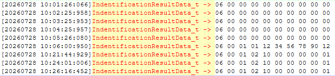

# 福建26年1批扩展台体台区识别记录

## 台体电源特点

- 两个CCO的频率变化特别小

```txt

==========================================================================================
HPLC CCO/STA Frequency Analysis
==========================================================================================
Log File   : 福建台体实测日志-100000000001.log
Target MAC : 10:00:00:00:00:01
Match Count: 40
==========================================================================================
Time                        CcoFreq     StaFreq        Diff
------------------------------------------------------------------------------------------
20260728 15:01:57:663     49.984806   49.985603   -0.000797
20260728 15:03:32:666     49.972816   49.972816    0.000000
20260728 15:05:07:662     49.980007   49.978408    0.001599
20260728 15:06:42:663     50.005600   50.004798    0.000802
20260728 15:08:17:671     49.984806   49.985603   -0.000797
20260728 15:11:27:677     50.048046   50.048046    0.000000
20260728 15:13:02:637     49.982406   49.981605    0.000801
20260728 15:14:37:621     49.972015   49.971218    0.000797
20260728 15:16:12:661     49.977611   49.979209   -0.001598
20260728 15:17:47:643     49.992000   49.993598   -0.001598
20260728 15:19:22:632     50.004798   50.003200    0.001598
20260728 15:20:57:646     50.012001   50.010402    0.001599
20260728 15:22:32:614     50.029617   50.030418   -0.000801
20260728 15:24:07:620     50.010402   50.009601    0.000801
20260728 15:25:42:618     49.995201   49.996002   -0.000801
20260728 15:27:17:622     50.022411   50.021610    0.000801
20260728 15:28:52:606     50.042434   50.041633    0.000801
20260728 15:30:27:632     50.042434   50.040832    0.001602
20260728 15:32:02:726     50.049648   50.048847    0.000801
20260728 15:33:37:627     50.015205   50.014404    0.000801
20260728 15:35:12:575     49.975212   49.976013   -0.000801
20260728 15:36:47:609     49.972816   49.974414   -0.001598
20260728 15:38:22:583     49.982406   49.982406    0.000000
20260728 15:39:57:563     50.007999   50.007202    0.000797
20260728 15:41:32:575     50.027214   50.025611    0.001603
20260728 15:43:07:588     50.047245   50.048046   -0.000801
20260728 15:44:42:587     50.052856   50.051254    0.001602
20260728 15:46:17:588     50.045642   50.044036    0.001606
20260728 15:47:52:582     49.977611   49.976810    0.000801
20260728 15:49:27:662     50.047245   50.047245    0.000000
20260728 15:51:02:619     49.977611   49.976810    0.000801
20260728 15:52:37:570     49.992000   49.992000    0.000000
20260728 15:54:12:609     50.043235   50.040832    0.002403
20260728 15:55:47:574     50.004798   50.005600   -0.000802
20260728 15:57:22:564     49.977611   49.976810    0.000801
20260728 15:58:57:575     49.984806   49.985603   -0.000797
20260728 16:00:32:571     50.045642   50.047245   -0.001603
20260728 16:02:07:587     50.025611   50.024009    0.001602
20260728 16:03:42:564     50.042434   50.041633    0.000801
20260728 16:15:07:546     50.000000   50.000801   -0.000801

==========================================================================================
Statistics
==========================================================================================
Item                Average            Max            Min
------------------------------------------------------------
CcoFreq           50.008856      50.052856      49.972015
StaFreq           50.008556      50.051254      49.971218
Diff               0.000301       0.002403      -0.001603
==========================================================================================
```
```txt

==========================================================================================
HPLC CCO/STA Frequency Analysis
==========================================================================================
Log File   : 福建台体实测日志-100000000001.log
Target MAC : 12:34:56:78:90:12
Match Count: 59
==========================================================================================
Time                        CcoFreq     StaFreq        Diff
------------------------------------------------------------------------------------------
20260728 14:57:28:478     50.031219   49.987201    0.044018
20260728 15:00:18:474     50.030418   49.980808    0.049610
20260728 15:03:08:531     50.016803   49.969619    0.047184
20260728 15:04:50:490     50.012802   49.986404    0.026398
20260728 15:05:24:444     50.013603   50.026413   -0.012810
20260728 15:05:58:439     50.024009   50.021610    0.002399
20260728 15:08:48:456     50.028816   50.036827   -0.008011
20260728 15:09:52:680     50.027214   50.026413    0.000801
20260728 15:12:46:704     50.012802   50.034423   -0.021621
20260728 15:15:36:709     50.024009   50.041633   -0.017624
20260728 15:16:10:436     50.018405   49.979209    0.039196
20260728 15:16:44:421     50.020008   50.021610   -0.001602
20260728 15:17:52:448     50.020008   50.006401    0.013607
20260728 15:18:26:430     50.016006   49.995201    0.020805
20260728 15:19:34:405     50.020008   50.047245   -0.027237
20260728 15:20:08:434     50.112251   49.989601    0.122650
20260728 15:22:58:441     50.012802   50.029617   -0.016815
20260728 15:25:14:446     50.012001   49.999198    0.012803
20260728 15:25:48:432     50.020809   50.020809    0.000000
20260728 15:27:30:386     50.019207   50.043235   -0.024028
20260728 15:28:04:403     50.015205   49.966423    0.048782
20260728 15:28:38:406     50.007999   49.988803    0.019196
20260728 15:29:46:379     50.023212   49.972816    0.050396
20260728 15:30:20:384     50.012802   50.032020   -0.019218
20260728 15:30:54:379     50.021610   50.012802    0.008808
20260728 15:32:36:381     50.027214   49.978408    0.048806
20260728 15:33:10:375     50.027214   50.032821   -0.005607
20260728 15:35:26:363     50.018405   49.994400    0.024005
20260728 15:36:34:702     50.017604   49.980808    0.036796
20260728 15:37:08:361     50.021610   50.001598    0.020012
20260728 15:37:42:356     50.016803   50.040031   -0.023228
20260728 15:38:16:401     50.021610   49.969619    0.051991
20260728 15:38:50:578     50.012802   50.052055   -0.039253
20260728 15:40:32:393     50.025611   50.050449   -0.024838
20260728 15:41:06:369     50.024009   50.028816   -0.004807
20260728 15:42:14:510     50.016803   49.980007    0.036796
20260728 15:43:22:351     50.019207   50.041633   -0.022426
20260728 15:45:38:339     50.024810   49.992801    0.032009
20260728 15:46:12:343     50.019207   50.044841   -0.025634
20260728 15:46:46:340     50.012802   49.968818    0.043984
20260728 15:47:20:380     50.015205   49.977611    0.037594
20260728 15:47:54:335     50.028015   49.975212    0.052803
20260728 15:49:02:383     50.012001   50.028816   -0.016815
20260728 15:50:10:429     50.015205   50.040031   -0.024826
20260728 15:51:52:340     50.032020   50.033622   -0.001602
20260728 15:56:24:359     50.024009   50.043235   -0.019226
20260728 15:57:32:615     50.012802   49.988803    0.023999
20260728 15:58:40:351     50.012802   49.981605    0.031197
20260728 16:00:22:339     50.011203   50.046443   -0.035240
20260728 16:02:04:383     50.027214   50.024009    0.003205
20260728 16:02:38:329     50.022411   49.973613    0.048798
20260728 16:04:20:355     50.009601   49.976013    0.033588
20260728 16:07:44:314     50.015205   50.040031   -0.024826
20260728 16:09:26:512     50.025611   49.968818    0.056793
20260728 16:10:00:296     50.024009   49.991203    0.032806
20260728 16:11:08:303     50.015205   49.993598    0.021607
20260728 16:12:57:947     50.014404   50.005600    0.008804
20260728 16:14:04:228     50.020008   50.025611   -0.005603
20260728 16:15:12:251     50.027214   49.993598    0.033616

==========================================================================================
Statistics
==========================================================================================
Item                Average            Max            Min
------------------------------------------------------------
CcoFreq           50.021083      50.112251      50.007999
StaFreq           50.008151      50.052055      49.966423
Diff               0.012932       0.122650      -0.039253
==========================================================================================

```

## 东软CCO特点

- 只能识别第一次查询的结果
- 如果第一次查询的结果不符合预期，即使后面上报的结果符合预期，CCO也不上报正确的结果



## 解决方案

- 调整了算法的参数，增大最小样本量个数，防止样本数量过少时结果算错

### 台区识别算法开源仓库地址

- [Gitee 仓库](https://gitee.com/tangrenbin/feeder_zone_identification)
- [GitHub 仓库](https://github.com/Tangrenbin/feeder_zone_identification)

## 时间

- 2026-07-28

