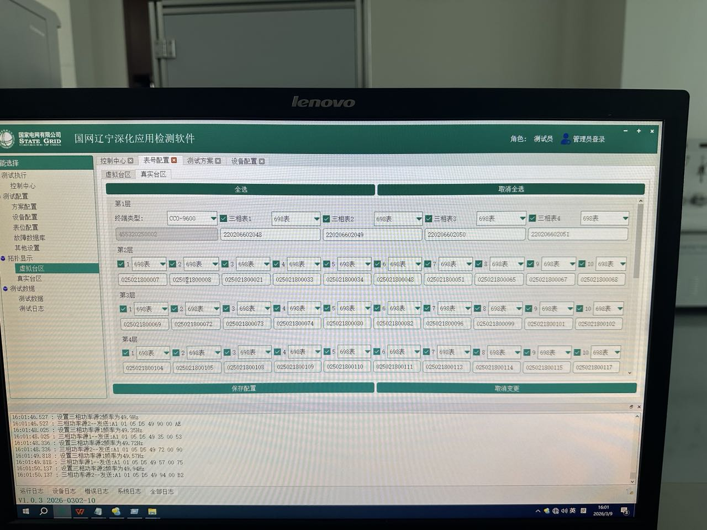
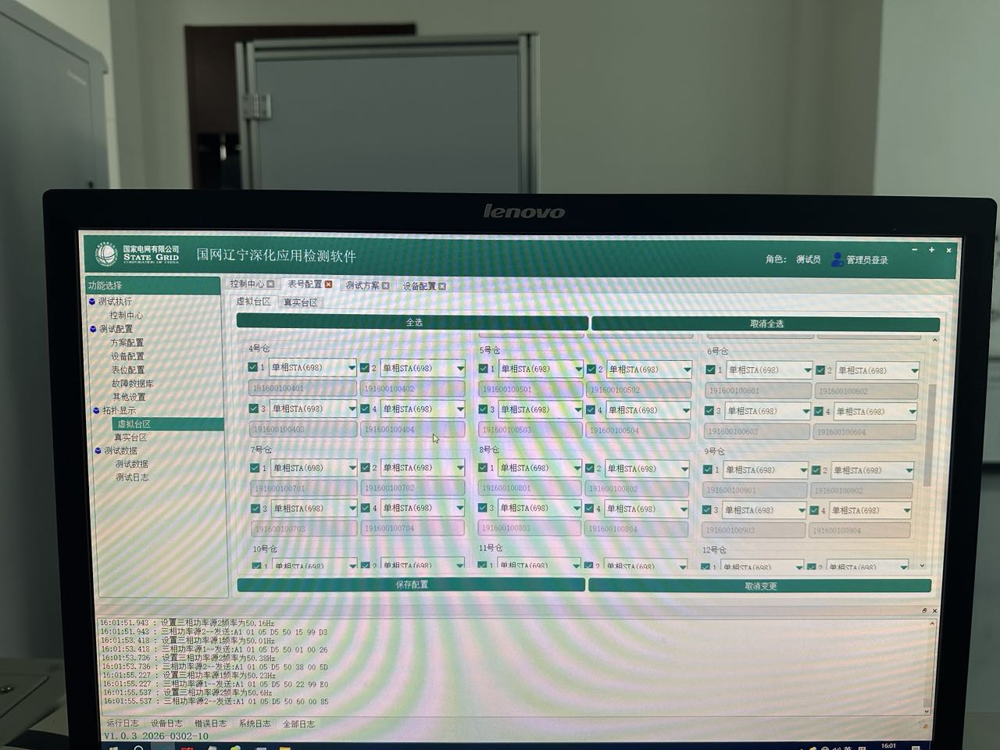
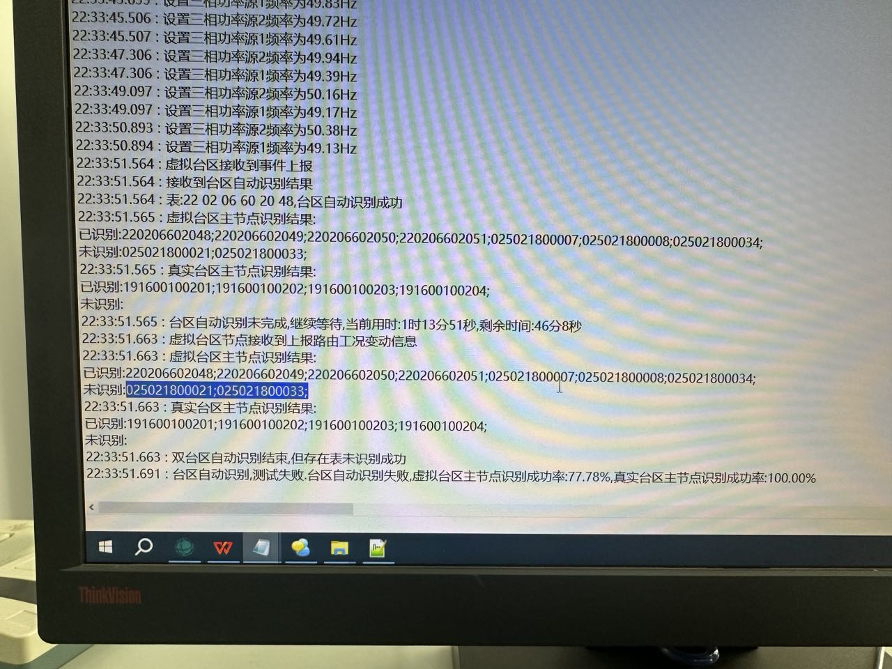

# 辽宁26年1批送检记录

## 修改点一

- 切换了一个全新的台区识别算法，并且开源了算法，供广大开发者参考。

### 台区识别算法开源仓库地址

- [Gitee 仓库](https://gitee.com/tangrenbin/feeder_zone_identification)
- [GitHub 仓库](https://github.com/Tangrenbin/feeder_zone_identification)

### 原因

- 辽宁应该是购买了新的测试台体，原来的台区识别算法不能满足要求
- 台区识别过程中会动态变化两个台区的电源频率，要求识别结果与预设相同，不能设别错误

### 修改日期

- 2026-03-30
