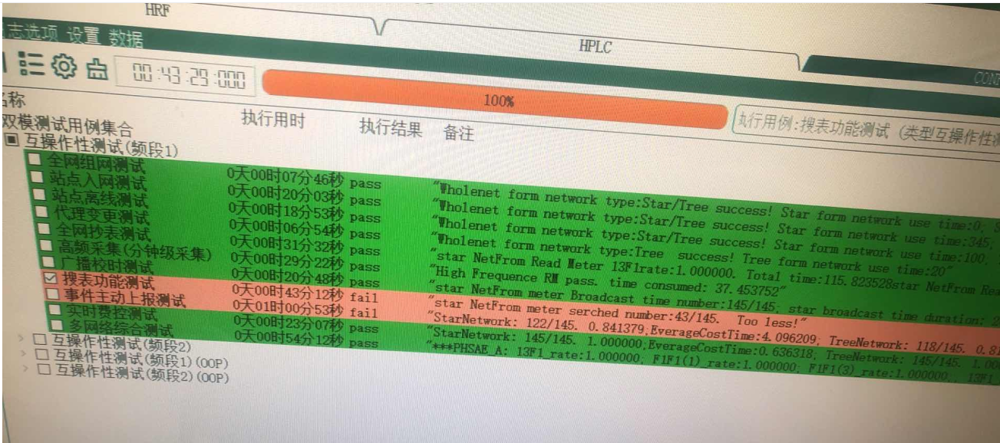
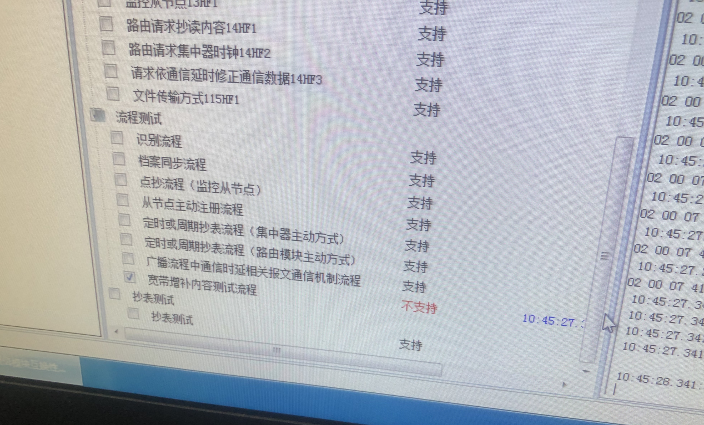

# 重庆 2026 年一批送检测试记录

## 修改点一

- 修正 CCO 对台体确认帧中 PRM 位异常的兼容处理

### 原因

- 在 AFN6F4 上报后，台体返回的确认帧中 PRM 位存在异常。此前 CCO 会将该确认帧误判为“未收到确认帧”，进而触发重复上报，导致整体上报流程被拉长，最终引发台体超时并造成测试失败。

### 报文示例

```txt
uxt <28>:68 1c 00 c3 00 00 00 00 00 2d 06 08 00 01 03 00 00 01 12 01 02 04 00 01 00 00 1d 16 
uxr <21>:68 15 00 43 00 00 00 00 00 2d 00 01 00 ff ff ff ff 00 00 6d 16 
```

### 修改日期

- 2026-03-11

### 失败用例截图



## 修改点二

- 当档案数量少于抄表最大并发数时，将最大并发数调整为“档案数 - 1”

### 原因

- 在增补内容测试流程中，仅向 CCO 同步了 10 个表档案信息。当下发的并发抄表数量超过 10 时，后续抄表帧中携带的表地址已不在档案范围内。按照台体要求，CCO 此时返回的错误码不能为 `07`（表号不存在），而应返回 `109`（超过最大并发数）。

### 修改日期

- 2026-03-11

### 失败用例截图



## 其他

- 技术规范中提到的`软件版本比对`功能在本次送检中并未实际进行测试

